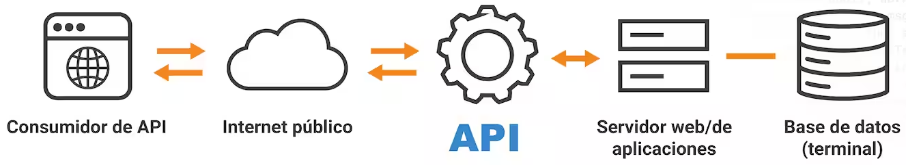

## ¿Para qué usamos Clases en Python?

Uno de los principales conceptos de python es la programación orientada a objetos (Object Oriented Programming, OOP), es decir, sigue la filosofía de diseño de que todo son objetos. Este principio permite crear aplicaciones modulares, escalables y más fáciles de mantener. 

Dentro de OOP, las clases permiten organizar y agrupar datos y funciones que pertenecen a un objeto. En otras palabras, una clase es como una plantilla para los objetos, un conjunto de características (atributos) e instrucciones (funciones o métodos) de como debe comportarse o que tiene que hacer. 

Poniendo un ejemplo del día a día, podríamos tener una clase llamada `Coche`. El coche puede tener atributos como `color`, `marca` y `matricula` y tiene las funciones de `arrancar()` y `detener()`. A continuación se muestra la representación de esta clase en python:
```
class Coche:
    def __init__(self, color, marca, matricula):
        self.color = color
        self.marca = marca
        self.matricula = matricula
    
    def arrancar(self):
        return f'El coche {self.marca} {self.color} con matricula {self.matricula} ha arrancado'
    
    def detener(self):
        return f'El coche {self.marca} {self.color} con matricula {self.matricula} ha parado'

coche_1 = Coche('rojo', 'ford', '1234AAA')  # El coche ford rojo con matricula 1234AAA ha arrancado
print(coche_1.arrancar())
```
Se define la clase `Coche` y se inicializan los atributos (`color`, `marca` y `matricula`) en el método `__init__`. Una vez inicializados, estos atributos se pueden acceder a lo largo de la clase. En este caso se emplean los atributos para devolver un string en los métodos `arrancar()` y `detener()`

En resumen, las clases tienen los siguientes objetivos:
* **Organización**: ayudan en la estructuración del código. Se agrupa en objetos o unidades lógicas.
* **Reutilización**: una misma clase se puede reutilizar a lo largo del código. Se pueden crear objetos basados en una clase sin necesidad de repetir código.
* **Facilita el mantenimiento**: con la programación OOP se puede acceder más fácilmente a la parte de código que se quiere modificar o actualizar.  

## ¿Qué es un método dunder?

Un método dunder (double underscore), tambien conocido por método especial, es un método que tiene un nombre que comienza y termina con dos guiones bajos (ej. `__init__`). 

Python hace uso de estos métodos para realizar tareas específicas y permitir la iteracción de objetos de manera más intuitiva y controlada. 
Python llama a los métodos dunder de manera automática cuando se realizan ciertas operaciones (ej. ejecuta `__init__` cuando se crea una instancia de una clase). Sin embargo, aunque no es lo más común, también pueden ser llamados directamente por el usuario. 

Los métodos dunder permiten personalizar clases y objetos. Se utilizan para definir cómo se comportan los objetos en sicuaciones específicas. Los métodos dunder más comunes son:
* `__init__`: constructor de la clase, permite la inicialización de un objeto.
```
class Libro:
    def __init__(self, titulo, autor):
        self.titulo = titulo
        self.autor = autor

libro_1 = Libro('17 segundo','Kirmen Uribe')
print(libro_1.titulo) # 17 segundo
print(libro_1.autor) # Kirmen Uribe
```

* `__str_`: representación de un objeto como cadena de texto
```
class Libro:
    def __init__(self, titulo, autor):
        self.titulo = titulo
        self.autor = autor
    def __str__(self):
        return f'El libro {self.titulo} es de {self.autor}'

libro_1 = Libro('17 segundo','Kirmen Uribe')
print(libro_1) # El libro 17 segundo es de Kirmen Uribe
```
* `__add__`: cómo sumar do objetos
```
class Punto:
    def __init__(self, x, y):
        self.x = x
        self.y = y

    def __add__(self, otro):
        return Punto(self.x + otro.x, self.y + otro.y)

punto1 = Punto(2, 3)
punto2 = Punto(4, 1)

resultado = punto1 + punto2 # (2 + 4, 3 + 1)
print(resultado.x, resultado.y)  # 6 4
```
* `__eq__`: cómo se compara si dos objetos son iguales
```
class Libro:
    def __init__(self, titulo, autor):
        self.titulo = titulo
        self.autor = autor
    def __eq__(self, otro_libro):
        return self.titulo == otro_libro.titulo and self.autor == otro_libro.autor

libro_1 = Libro('17 segundo','Kirmen Uribe')
libro_2 = Libro('17 segundo','Kirmen Uribe')
libro_3 = Libro('Zerria','Patxi Zubizarreta')

print(libro_1 == libro_2) # True
print(libro_1 == libro_3) # False
```

* `__len__`: el comportamiento de la función `len()` para un objeto
```
class ListaNum:
    def __init__(self, nums):
        self.nums = nums
    
    def __len__(self):
        return len(self.nums)

lista_1 = ListaNum([1, 2, 3, 4])
print(len(lista_1))  # 4
```

## ¿Qué método dunder se ejecuta automáticamente cuando se crea una instancia de una clase?

Cuando se llama a una clase de Python se ejecuta automáticamente el método `__init__`. Se conoce como el constructor de la clase y en ella se **inicializan los atributos** que luego pueden ser accedidos a lo largo del código. Este método es útil porque permite crear objetos con valores personalizados.

Se define de la siguiente forma. El primer parámetro que se le da es `self`, que hace referencia al objeto que se está creando. Después se pasan valores que se quieran. 
```
class Usuario:
    def __init__(self, nombre, apellido):
        self.nombre = nombre
        seld.apellido = apellido
```
 
Teniendo esta clase `Usuario`, se puede crear un objeto. Como al objeto se le asignan el `nombre` y el `apellido`, después se puede acceder directamente a esos parámetros.
```
usuario_1 = Usuario('Juan','Lopez')
print(usuario_1.nombre) # Juan
print(usuario_1.apellido) # Lopez
```

Si no se define el método `__init__`, python crea un método por defecto que no hace nada. Se pueden crear funciones dentro de la clase pero el objeto no tendrá ningún atributo inicializado. 


## ¿Qué es un decorador de python?

Un decorador es una función que toma comonentrada una función y a su vez devuelve otra función; por tanto, al trabajar con un decorador, estaremos trabajando con al menos 3 funciones: la entrada, el retorno y la función principal. 
```
def f_principal(f_entrada):
    def f_retorno:
        print('Antes de ejecutar la función de entrada')
        f_entrada()
        print('Despues de función entrada')

    return f_retorno
```
Teniendo este decorador, ahora solo quedaría decorar una función, con esto, se consigue modificar el comportamiento de una función ya existente, pero sin tener que modificar su código. Este decorador se podría llamar de la siguiente manera:
```
def saludar():
    print('¡Hola!')

saludo = f_principal(saludar)
saludo()
```
Sin embargo, python ofrece una manera más fácil de decorar una función, usando `@`. En este caso se decora la función `saludar()` con `f_principal`, así, se ejecutarán la función principal tomando como entrada la función `saludar()`. Con esto se reduce la cantidad de código necesario y la lectura es más fácil. 

```
@f_principal
def saludar():
    print('¡Hola!)

saludar()

# Resultado:
#   Antes de ejecutar la función de entrada
#   ¡Hola!
#   Despues de función entrada
```

## ¿Qué es una API y cuáles son los tres verbos de API?

API significa **Interfaz de Programación de Aplicaciones** (Application Programming Interface). Es un conjunto de protocolos, rutinas y herramientas que permiten que las aplicaciones de software se comuniquen entre sí. Define los métodos y formatos de datos que las aplicaciones pueden utilizar para solicitar e intercambiar información.




Un ejemplo en la vida real puede ser el de un restaurante. En este caso el menú es la API. El menú da al cliente una lista de platos que se pueden servir, pero no es necesario que el cliente sepa como se preparan. El cliente hace el pedido (solicitud) al camarero (sistema de procesamiento) y este luego trae el plato (respuesta).

Con el objetivo de realizar acciones sobre los datos o recursos, las APIs hacen uso de verbos HTTP. Los tres verbos más comunes son **GET**, **POST** Y  **PUT**. Estos verbos permiten que las aplicaciones se comuniquen entre sí de manera eficiente.

### 1. GET: Obtener datos
El verbo GET se utiliza cuando se quiere obtener información que ya está almacenada en un servidor. Sirve para leer datos pero sin modificarlos en el servidor. 

Por ejemplo en una biblioteca, si tenemos una base de datos que contiene toda la información de los libros como puede ser el título o el autor, con el verbo GET podríamos leer todos los datos sobre los libros que nos interesen. 

### 2. POST: Crear datos
POST se usa para enviar datos a un servidor, normalmente creando una nueva entrada. Se emplea cuando se quieren agregar nuevos datos o se quiere realizar una acción que cambie algo en el servidor. 

Siguiendo el ejemplo de la biblioteca, con el verbo POST podríamos agregar en la base datos un nuevo libro con toda su información. 

### 3. PUT: Actualizar datos
El verbo PUT se utiliza para actualizar un dato que ya existe en el servidor. PUT reemplaza la información existente con los nuevos datos que se envían.

En una biblioteca puede pasar que el nombre del autor sea incorrecto, en este caso, por ejemplo se podría cambiar el nombre erróneo con el bueno. 

## ¿Qué es Postman?

Postman es una herramienta para probar y desarrollar APIs de manera fácil y rápida. Para ello, permite enviar solicitudes HTTP (GET, POST, PUT) a un servidor y recibir las respuestas, lo que ayuda a ver que la API funciona correctamente. 

Es muy útil a la hora de dasarrollar una aplicación ya que permite probarla sin necesida de tener la aplicación completa. Además, permite guardar la solicitudes realizadas de manera ordenada para después poder hacer el seguimiento de los test realizados. 

Asimismo, permite la automatización de pruebas, se pueden escribir scripts para realizar test automáticamente, esto ayuda en el aseguramiento de calidad y agiliza el desarrolo ya que permite detectar errores lo antes posible. 

## ¿Es MongoDB una base de datos SQL o NoSQL?

MongoDB es una base de datos **NoSQL**, es decir, no sigue el modelo tradicional de bases de datos relacionales (SQL), no utiliza el modelo de tablas y relaciones.

Las bases de datos NoSQL están diseñadas para almacenar grandes cantidades de datos de manera flexible y de forma más eficiente cuando se trabaja con datos no estructurados o semi-estructurados, es decir, con datos que no siguen un conjunto de reglas o una estructura predeterminada. 

Mientras que SQL usa tablas, filas y columnas para organizar los datos, las bases de datos NoSQL están basadas en otros modelos de datos como pueden ser documentos, clave-valor que no requieren un esquema fijo.

En cuanto a MongoDB, como se ha mencionado anteriormente, es una base de datos NoSQL que está orientada a documentos similares a JSON. Se almacenan los datos en documentos flexibles, es decir, no tienen que tener el mismo formato. Esto facilita trabajar con diferentes tipos de datos. 

## ¿Qué es el polimorfismo?

El polimorfismo significa que algo puede tener muchas formas, en programación el polimorfismo se refiere a la capacidad de un objeto de tomar diferentes formas. Es decir, a que diferentes clases tengan métodos con el mismo nombre pero con distinto comportamiento.

En el siguiente ejemplo se puede ver que la función `render` es polimorfa, dependiendo del tipo de clase que lo llame devolverá un string diferente. Sin embargo, aunque sea una clase diferente, se puede llamar la función de la misma manera.  

```
class Encabezado:
    def __init__(self, content):
        self.content = content
    def render(self):
        return f'<h1>{self.content}</h1>'
    
class Div:
    def __init__(self, content):
        self.content = content
    def render(self):
        return f'<div>{self.content}</div>'   
    
def html_render(clase_objeto):
    print(clase_objeto.render())


div_one =Div('Contenido en div')
encabezado = Encabezado('Encabezado grande')

html_render(div_one) # <div>Contenido en div</div>
html_render(encabezado) # <h1>Encabezado grande</h1>
```

El polimorfismo ayuda a tratar los objetos de diferentes clases de manera uniforme. Así, el código es más flexible  y reutilizable. Gracias a esto, se puede reducir el código duplicado y cambiar la implementación de métodos sin afectar al resto del código que los utiliza.